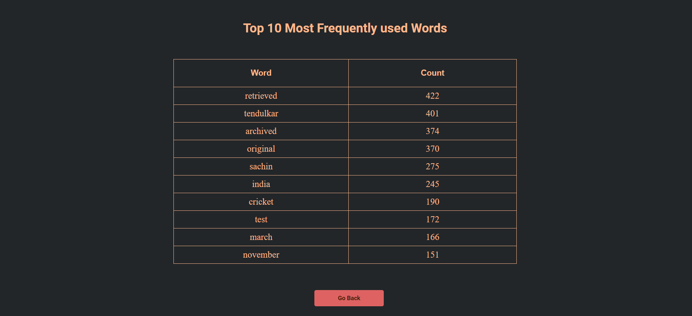

# Wikipedia-Scraper
## Table of Contents
* [About the project](#about-the-project)
* [Tech Stack used](#tech-stack-used)
* [Install and Run](#install-and-run)

## About the project
This repository contains a Wikipedia-scraper that will scrape the entire wikipedia page and tell us the top 10 Most Frequently used words.
It is made using Python as a Backend and HTML CSS in the frontend.
I have also deployed it on heroku : https://wikipedia-scraper.herokuapp.com/

Enter a valid wikipedia URL and click on submit.


It will show the results i.e. top 10 frequently used words on that page.
 
 

## Tech Stack used 
Project is created with :
HTML, CSS, Flask, Python.

## Install and Run

1. Clone the repo
  ```
  $ git clone https://github.com/realpython/flask-boilerplate.git
  $ cd flask-boilerplate
  ```

2. Initialize and activate a virtualenv:
  ```
  $ virtualenv --no-site-packages env
  $ source env/bin/activate
  ```

3. Install the dependencies:
  ```
  $ pip install -r requirements.txt
  ```

5. Run the development server:
  ```
  $ python app.py
  ```

6. Navigate to [http://localhost:5000](http://localhost:5000)
